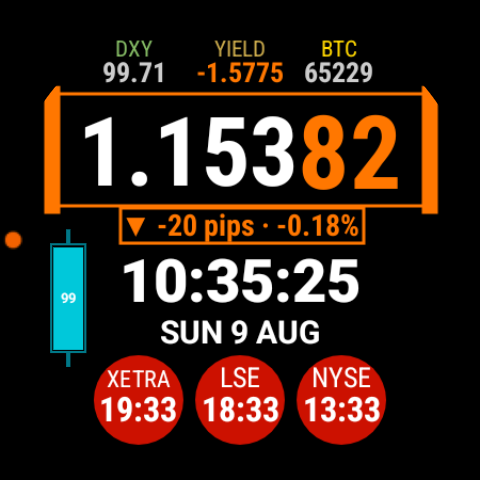
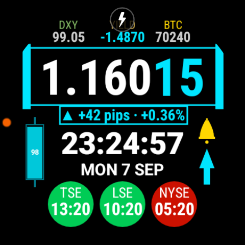
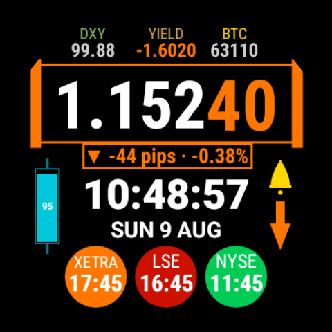
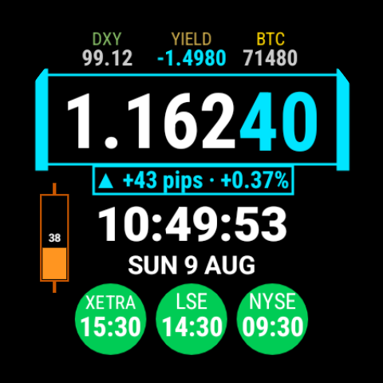
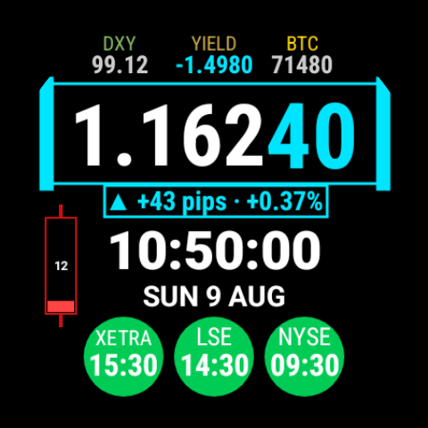
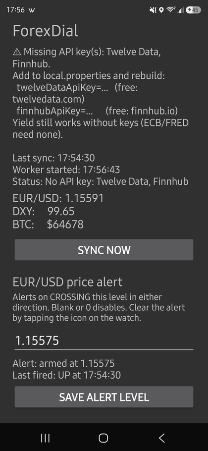
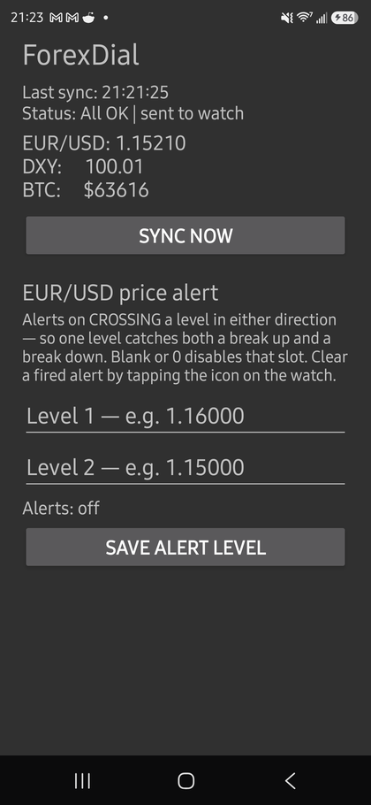

# ForexDial

**v1.1.0**

A terminal-style forex watch face for **Wear OS 3+** (built and tested on a Samsung Galaxy Watch 7, Wear OS 6), with a phone companion app that fetches the data.

Shows EUR/USD with pip-level precision, the DXY dollar index, BTC, the EUR–US 2-year yield spread, live forex-session status for Tokyo, London and New York, and price alerts that buzz your wrist and flash on screen when EUR/USD crosses a level you set.

<p align="center">
  
</p>

<p align="center"><em>Live, on a Galaxy Watch 7. EUR/USD up on the day — so the rate box, pip digits, pips bar and yield all read cyan. Tokyo open, London and New York closed, battery full.</em></p>

---

## What it looks like

Everything is colour-coded on one convention: **cyan = up, orange = down.** One glance tells you direction without reading a number.

| Alert fired upward | Alert fired downward |
|---|---|
|  |  |
| Bell + cyan arrow, flashing once a second. | Orange arrow for a downward cross. |

| Battery 20–50% | Battery under 20% |
|---|---|
|  |  |
| The candle turns amber and the fill drops with the charge. | Red below 20%. Wick, body and fill all shift together. |

<sub>The hero and battery shots are live. The alert shots are staged, and their
session dials are left over from <strong>v1.0.0</strong>, when the dials tracked stock
exchanges — they read TSE / LSE / NYSE and their clocks do not hold a real set of
timezone offsets. They are being regenerated; the face itself is correct. A pair of
shots claiming all three sessions open at once has been removed outright: under forex
hours Tokyo and New York never overlap, so that state cannot occur.</sub>

---

## You need your own API keys

**This is not optional and there is no shared key.** Two of the data feeds are metered, and the free tiers are sized for roughly one user each:

- Twelve Data's free tier allows **800 credits/day**. ForexDial's default polling uses about **720/day** — so a single key realistically serves one person.

Keys are read from `local.properties`, which is gitignored and **never committed**. A fresh clone builds with no key baked in, so you must supply your own before anything works.

Both are free and take a couple of minutes:

| Service | Used for | Sign up |
|---|---|---|
| **Twelve Data** | EUR/USD, DXY basket | <https://twelvedata.com> |
| **Finnhub** | BTC | <https://finnhub.io> |

The yield spread needs **no key** — it comes from the ECB and FRED, which are open. That part of the face works even with nothing configured.

---

## Setup

### 1. Add your keys

If you skip this step the app still builds and runs — it just tells you which keys are missing, and the yield spread keeps working since it needs none:

<p align="center">
  
</p>

Create or edit `local.properties` in the project root:

```properties
sdk.dir=/path/to/your/Android/Sdk
twelveDataApiKey=your_twelve_data_key_here
finnhubApiKey=your_finnhub_key_here
```

`sdk.dir` is written automatically by Android Studio the first time you open the project. Add the two key lines yourself.

This file is gitignored and never committed — which is why a fresh clone builds with no key baked in, and why you can share a build of this without leaking your own quota.

### 2. Build

```bash
./gradlew assembleDebug
```

### 3. Install

There are **three** packages, and you need all three. This is a platform constraint, not a design choice — see [Why three packages](#why-three-packages).

Phone (connect over USB, enable USB debugging):

```bash
adb -s <phone-serial> install -r companion-app/build/outputs/apk/debug/companion-app-debug.apk
```

Watch (enable Wireless debugging in Developer options, then `adb pair` / `adb connect`):

```bash
adb -s <watch-addr> install -r wear-app/build/outputs/apk/debug/wear-app-debug.apk
adb -s <watch-addr> install -r watchface-wff/build/outputs/apk/debug/watchface-wff-debug.apk
```

If a streamed install fails on the watch (it sometimes does over wireless ADB), push and install locally instead:

```bash
adb -s <watch-addr> push watchface-wff/build/outputs/apk/debug/watchface-wff-debug.apk /data/local/tmp/wf.apk
adb -s <watch-addr> shell pm install -r /data/local/tmp/wf.apk
```

### 4. Select the watch face

Long-press the watch face → swipe to **ForexDial** → tap to select.

---

## Using it

**Data refresh.** The phone polls prices every 3 minutes and pushes to the watch. Tapping anywhere on the face requests an immediate sync rather than just re-reading the local cache.

**Price alerts.** In the phone app, enter up to **two levels** under *EUR/USD price alert* and hit save. Leave a slot blank to use just one, or clear both to disable. The status line shows what's armed and which level last fired:

<p align="center">
  
</p>

When EUR/USD **crosses** that level in either direction, the watch buzzes twice and a flashing bell + direction arrow appears on the right of the clock — see [the alert shots above](#what-it-looks-like).

It keeps buzzing every 5 seconds until you acknowledge it, giving up after 5 minutes, with an ongoing notification while it's active. **Tap the icon on the watch — or the notification — to clear it.** The arrow shows the direction of the *crossing*, not the current tick, so it can legitimately point down while the pips bar shows ▲.

> **Exempt the watch app from battery optimisation, or you'll only get one buzz.**
> The repeating reminder runs as a foreground service, and Android refuses to
> start one from the background unless the app is exempt — verified on-device:
> without it you get `ForegroundServiceStartNotAllowedException`. The app
> degrades gracefully (a single buzz, no crash), but for the repeat you need:
>
> ```bash
> adb -s <watch-addr> shell dumpsys deviceidle whitelist +com.reddoor3.forexdial
> ```
>
> Or on the watch: **Settings → Apps → ForexDial → Battery → Unrestricted.**

It fires on the *crossing*, not on merely being past the level — so it alerts once per crossing rather than nagging every sync for as long as price stays beyond your threshold. Clearing it is permanent for that crossing: dismiss it and it stays gone until price crosses again.

The levels aren't an upper/lower pair — each one is watched in **both** directions, so two levels give you four possible triggers. If a single 3-minute step gaps through both (news, thin liquidity), the watch reports the level **nearest** the current price: the most recent break, and the reference that still matters where price actually is.

**Reading the face:**

- **Cyan = up, orange = down** throughout (this is a personal convention, not the usual green/red).
- **EUR/USD** — last two digits are larger and direction-coloured; the box border tracks intraday direction.
- **YIELD** — the EUR−US 2-year spread, coloured by **day-over-day change**: cyan if the spread rose (EUR rate advantage improved), orange if it fell. Note this is the *direction of the move*, not the level — orange on a negative spread means "got worse for EUR today."
- **Battery candle** — cyan above 50%, amber 20–50%, red below 20%.
- **Session dials** — green open, orange within 30 minutes of open/close, red closed. Local time inside each.

**Forex session hours.** These are *forex* sessions, not stock-exchange hours — the
two don't coincide. The FX week runs continuously from **Sunday 17:00** to **Friday
17:00 New York time**, so Sunday evening is a trading session and Friday evening is not:

| Session | Local hours | vs. the exchange in that city |
|---|---|---|
| Tokyo | 09:00–18:00 JST | TSE closes 15:30 and breaks for lunch; FX does neither |
| London | 08:00–17:00 | LSE closes 16:30 |
| New York | 08:00–17:00 ET | NYSE runs 09:30–16:00 |

Each session is defined in its own city's local time, so each follows its own
country's DST — London and New York shift on different dates and Japan doesn't
shift at all, which means the gap between the dials changes a few times a year.

---

## Data sources

| Value | Source | Frequency | Key? |
|---|---|---|---|
| EUR/USD | Twelve Data | 3 min | Yes |
| DXY | Twelve Data (5-pair basket, approximated) | basket cached 30 min | Yes |
| BTC | Finnhub | 3 min | Yes |
| EUR 2Y yield | ECB Data Portal (AAA euro-area curve) | 02:00 & 14:00 PT | No |
| US 2Y yield | FRED (`DGS2`) | 02:00 & 14:00 PT | No |
| Session status | Local calendar maths (FX hours) | continuous | No |

The yield legs are daily series, so they're polled twice a day rather than continuously. The spread is computed on the most recent day **both** sources cover — they publish on different lags, and pairing newest-with-newest silently spans two dates (measured ~4bp of error that way, enough to fake a day's move).

---

## Why three packages

Wear OS's **Watch Face Format** (WFF) is declarative XML with `android:hasCode="false"` — a watch face APK contains no executable code at all. Since this face renders custom bitmaps from live market data, the complication data sources must be Kotlin services, which cannot live in the watch face package. Hence:

| Package | Runs on | Contains |
|---|---|---|
| `companion-app` | Phone | API fetching, alert configuration, pushes to watch |
| `wear-app` | Watch | Complication data sources (the rendered bitmaps) |
| `watchface-wff` | Watch | The watch face layout itself (WFF XML) |

Google's own WFF samples follow the same constraint — even their Weather sample ships `hasCode="false"` with no services, relying on a built-in platform complication.

---

## Limitations

- **Sideload only.** Not on Google Play. Installing on Wear OS requires ADB.
- **One user per key.** See above — the free tiers don't stretch.
- **EUR/USD only.** The pair isn't configurable yet.
- **Wear OS 3+.** Wear OS 6 blocks programmatic (Kotlin) watch faces entirely, which is why this is WFF.
- Built against one device (Galaxy Watch 7, 450×450 round). Layout coordinates are tuned for that; other sizes will need adjustment.

---

## Versioning

Semantic versioning. The version lives in **one place** — `forexdialVersionName`
and `forexdialVersionCode` in [`gradle.properties`](gradle.properties) — and all
three modules read it from there, so they can never drift apart. They install
together, so a version skew between them would be meaningless.

The running version is shown at the top of the phone app, and each release is
tagged `v<version>` in git.

When bumping: raise `forexdialVersionCode` by 1 as well as the name. Android
compares the code, not the name, when deciding whether an install is an upgrade.

## License

[MIT](LICENSE) — use it, change it, redistribute it, no obligations beyond keeping the copyright notice.

The MIT grant covers **this code only**. The data feeds are governed by their own terms — you're using your own Twelve Data and Finnhub accounts under their agreements, and ECB/FRED data under theirs.

Provided as-is with no warranty and no support. Do your own diligence before relying on any number here for a trading decision.
